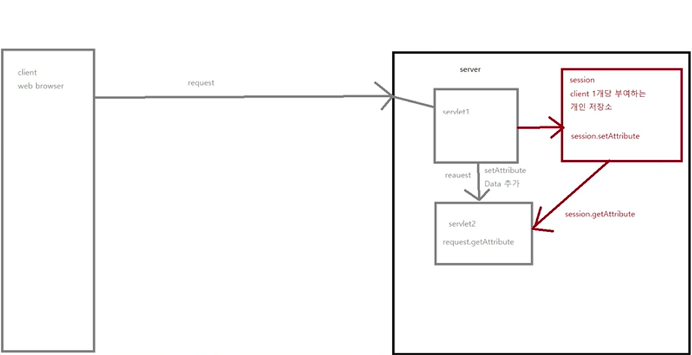
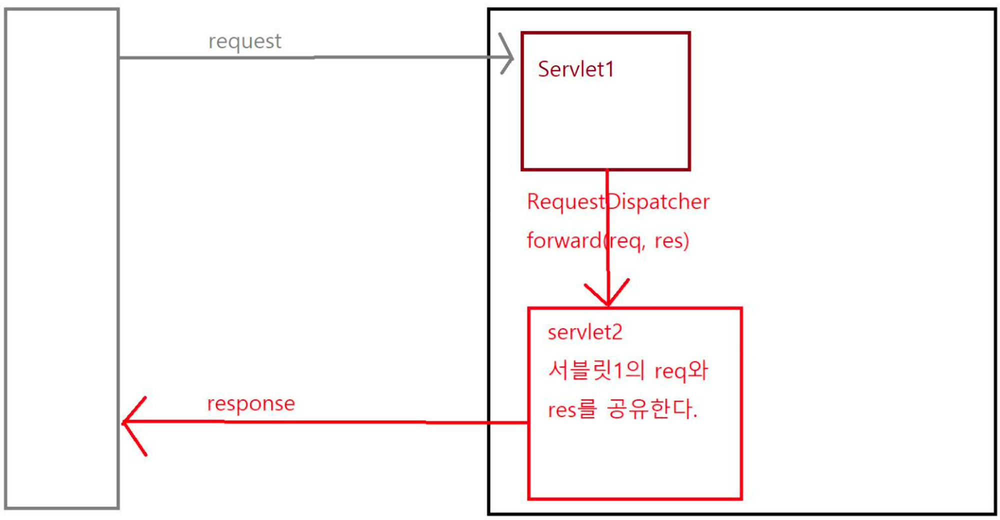
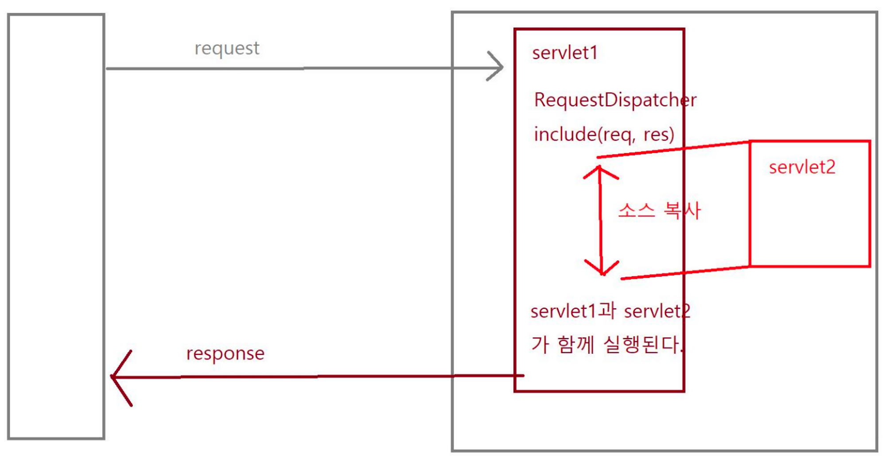

# Request, Session, Application

- 웹 어플리케이션 서버(WAS) :  웹 서버(Web Server) + 자바를 컴파일하여 실행할 수 있는 능력(JVM)    
- 웹 브라우저 1개를 클라이언트라고 함.
    - 이 클라이언트가 웹 브라우저에 들어왔을 때 클라이언트의 데이터를 저장하는 공간에는 아래와 같은 3가지가 있음
- Web container가 자바를 실행하는 공간
    - 웹 애플리케이션에서 자바 객체(Request)를 받아서 넘겨줌.
        - 이처럼 자바 객체에 정보를 담아서 Request 형태로 전달하면, 웹 컨테이너 쪽에서는 그에 대한 응답을 담아 Response로 보내게 되는데

          이 때 사용되는 객체를 `httpResponseServlet`이라고 함.


JSP도 Servlet으로 변환되어 실행하게 되는데, **각각의 Servlet 파일은 Servlet Config와 Context를 갖게 된다.**
이때 웹 프로젝트의 실행 환경인 이 Context들과 서로 상호작용이 가능하다.


---

### 클라이언트에 데이터가 들어올 때 저장할 수 있는 공간 3가지

`Request`

자바는 **요청도 객체로 만들어서 전달하는데, 그 때의 객체를 의미**한다.

`Session`

**클라이언트 1개당 부여되는 개인 저장소**

`Application`

**Servlet Context로 만들어진 객체**

---

### 데이터 전송 방법

`Request`



최초에 Request가 오면, 이 Request를 웹 서버가 받아서 넘겨 줌.

처음 실행하는 Servlet을 Servlet1이라고 할 때, 이 Servlet1이 이 Request를 받아서 다 처리하는 것이 아니라 또 다른 Servlet(servlet2)이 받아서 처리할 수 있음.

(+) 리퀘스트의 방식 : distpatcher.forward / distpatcher.include

이때 servlet1은 또 다른 servlet2와 데이터를 공유하는 방법으로 setAttribute를 통해서 데이터를 넘길 수 있음.

또한 request.getAttribute를 통해서 데이터를 넘겨 받을 수 있음.

---

`Session`

세션 역시 마찬가지로, 같은 방법으로 진행할 수 있음. (세션은 클라이언트 1개당 부여되는 개인 저장소라고 보면 됨)

Request처럼 Servlet1이 Servlet2를 호출할 시,

Servlet이 세션으로 데이터를 보낼 때 `session.setAttribute`로 해 놓으면

다른 Servlet은 `session.getAttribute`로 데이터를 받아볼 수 있음

---

`Application`

Application은 Servlet Context Object로, Servlet의 실행환경(프로젝트 1개의 실행환경)이다.

따라서 모든 Servlet은 Servlet Context를 공유 저장소로 사용 가능하다.

→ 누구나 접근이 가능하기 때문에 보안은 기대해서는 안 된다.

마찬가지로 Servlet1이 `application.setAtrribute`를 해 놓으면 Servlet2는 `application.getAttribute`로 보낸 데이터의 값을 받을 수 있다.

---

### Dispatch

request를 어딘가로 보내는 것이 **`request.Dispatcher`**임.

Servlet context의 set, getAttribute로 데이터를 공유할 수 있지만, 어플리케이션을 사용해서 데이터를 공유하는 것은 보안 상 결코 좋은 아이디어가 아님.

하지만 set, getAttribute를 사용하여 데이터를 공유하는 것은 굉장히 편하기 때문에, Spring에서 Request를 사용할 때 이를 사용함.

Servlet Context에서는 이러한 방법론을 가지고 있음.

---

Request가 살아있는 동안 데이터가 공유되고 있음.

이때 완전한 두 개의 독립파일을 만들어서 실행하는데, 세션은 웹 브라우저에 한 번 들어가서 나가기 전까지는 계속 살아 있음.

즉, 세션이 종료되기 전까지는 계속 데이터를 공유할 수 없다는 것을 의미함. 즉, 다른 웹 브라우저 들어가면 데이터를 가질 수 없음.

---

### 세션의 종료 케이스 3개

- 브라우저 종료
- 서버 다운
- `session.invalidate`

---

### Servlet Context

하나의 어플리케이션(=프로젝트, 서비스)의 실행 환경 전체를 의미.

한 Servlet Context 안에 데이터를 옮겨 놓으면, 다른 Servlet Context 안에 데이터를 옮겨 놓으면, 다른 Servlet이 이를 사용할 수 있음.

---

프로젝트 안에 있는 모든 Servlet이 하나의 Context 안에 있는 데이터를 공유함.

그래서 각각의 서블릿이 실행되어도 같은 데이터를 공유할 수 있음. Servlet Context의 종료를 하기 위해서는 서버 다운밖에 불가능함.

따라서 이걸로 변경 처리를 해주면 됨.

→ But 나중에 사용하는 사람들의 것이 Overwrite가 되어 버린다는 문제점이 있음!

---

### Context Path

프로젝트 이름으로, JSP 경로는 모두 폴더 밑으로 잡힘.

Tomcat이 외부와 통신하는 번호가 8080인데, 실행 후 주소창을 보면 jsp 폴더 밑에 있는 파일이 실행된다는 것을 확인할 수 있음.

서블릿의 실행 위치는 servlet context 밑으로 잡아야 하는데, 이걸 맞춰주려면 jsp에서는 액션 안에 context path를 넣어야 함

```html
<form method="get" action="<%= application.getContextPath() %>/Login07">
```

---

각각의 페이지에서 세션을 검사해서 활동하고 있는 유저인지, 아닌지 찾아내면 됨.

확인하려면 세션을 확인하면 됨.

---

### JSP Action Tag

- 만들 수 있는 태그
- 태그는 사실 서블릿, jsp 태그를 만들 수 있는데 jsp:액션 태그들이 있음.
- 이 액션 태그는 찾아보면 많이 있고, 또 우리가 태그를 만들어서 사용 가능함.

**`jsp param`**: 액션 태그 중 하나로, 스스로 만들어서 넣을 수 있음.

---

`<jsp:include> , <jsp:param>, <jsp:forward>`

→ 중요도는 상대적으로 떨어짐 그냥 한 번 보는 걸로 하자

---

### Forward vs Include

회색이 클라이언트, request를 보냄

request를 servlet1이 받음 → 그 요청을 servlet2한테 전달 (request dispather가 그걸 함)

`forward`



일반적인 태그에서는 forward가 없음.

그래서 액션태그를 사용해서 Forward를 하도록 만들어줘야 함.

---

**forward**에는 `request`, `response`라는 개념이 다 들어감

servlet1이 받은 `request`와 `response`를 servlet2도 똑같이 공유하는 개념이 됨. 거기에 servlet1의 request와 response를 공유함.

servlet2에서 response를 원래 요청했던 곳으로 전달

---

`include`



request dispatcher도 `response`과 `request`을 공유함

이때 다른 **servlet을 include를 하게 되면  소스가 해당 위치로 들어가게 됨 → 즉 소스 복사를 하게 됨.**

servlet1과 servlet2가 함께 컴파일 되며, 실행도 함께 됨

---

파일이 호출되지 않으면 컴파일이 되지 않으므로, 파일을 먼저 호출해주는 방식으로 진행해야 함.

**액션 태그를 쓰니까 include임에도 불구하고 따로따로 나옴.**

액션 태그를 쓰지 않으면 include 포함 합쳐서 진행하는데(변수를 공유하는 것이 가능함), **쓰면 합쳐서 진행하는 것이 불가능함.**

따라서 다른 jsp 파일에 있는 변수 사용이 불가능함.

---

### **액션태그를 사용하여 값을 주고 받는 방식**

`전통적인 방식`

```html
<% request.setAttribute(”data1”,”11111”);%>
```

`액션태그 안에 넣는 방식`

```html
<jsp:include page="./09jsp_action_include3.jsp">
<jsp:param value="22222" name="data"/>
</jsp:include>
```

→ 데이터를 받을 때에는 getAttribute로 받아주나, 이 때 param으로 넘긴 건 null로 나옴!

```html
<%= request.getAttribute("data1") %>
<%= request.getAttribute("data2") %>
```