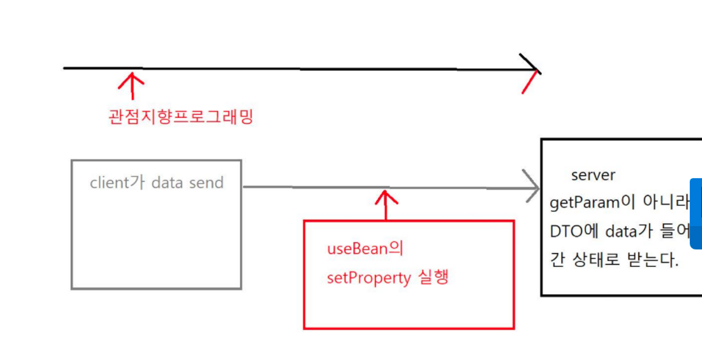
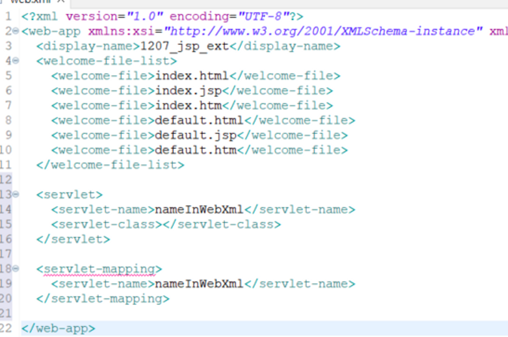

#UseBean / Web-xml /Custom tag / Dynamic Attribute

### useBean

`UseBean이란?`

- 데이터를 담아서 전달할 때 사용되는 JavaBean 객체를 만들어주는 액션 태그

---

useBean을 만들어서 사용해보면 VO를 자동으로 만들어주는 모습을 볼 수 있음.

→ Spring이 만들어진 배경 및 동작 원리를 확인할 수 있음.

---

VO와 DTO는 개념적으로 다르지만, 실제 실무에서는 그대로 사용하고 있음.

어차피 VO(Value Object) 객체도 final 값을 만들기 위해 객체를 만드는 것이 아니므로, 실무에서 이걸 구분하는 것에 큰 의미가 없음.

- VO와 DTO의 개념
    - VO는 값 그 자체를 나타내는 객체 → 생성자 사용 필수
    - DTO는 데이터를 담아 계층 간으로 전달하는 객체
    - DAO 가변적인 성격을 가진 클래스, 데이터베이스에 접근하기 위한 객체

      DAO를 통해 DTO를 세팅, DAO에 따라 DTO 값이 바뀜


---


- UseBean을 사용하기 위해서는 입력 폼과 VO가 필요
- DTO(VO) 변수와 화면 요소의 name이 동일해야 함.

  → 스프링은 파라미터를 자동으로 세팅해서 이 과정을 맞춰줌.


```html
<jsp:useBean id="myMember" class="jsp.MemberVO" scope="request" >
```

이 코드와 아래의 코드는 같은 내용임.

```java
MemberVO myMember = new MemverVO();
```

- scope는 지금 만든 이 객체의 변수가 가리키는 객체가 살아있는 범위임.

`Scope`

- page면, 타 페이지로 전달이 안 됨. 딱 그 페이지에서만 살아있음.
- request면 request가 살아있는 동안만 useBean이 살아있음.
- session이면 이 유저의 session 살아있는 동안임.
- application도 있으나, 이건 사용을 지양함,

  → session은 로그인 동안 계속 살아있어야 되는 로직이 있는지 확인해야 하므로

  request를 사용하는 것이 가장 평범한 로직임.


---

(+) Spring의 AOP(관점/시점 지향 프로그래밍)

- 관점을 기준으로 모듈화함.
    - 프로세스의 흐름을 놓고 봤을 때, 특정 시점에 끼어드는 것을 이야기함.

      client가 데이터를 send 한 후, 그 클라이언트가 send한 데이터가 서버에 도착하면,

      중간에 spring이 끼어 들어서  useBean의 setProperty를 실행시킴.

      서버는 세팅이 완료된 객체를 받게 됨.

      (getParameter가 아니라 **세팅된 DTO/VO를 받게 됨**)




---

### 커스텀 태그

- 사용자가 직접 만들어서 사용하는 태그로, JSTL(자바서버 페이지 표준 태그 라이브러리)의 동작 원리임.
- Prefix는 tag-dir의 경로를 대체하는 느낌으로 사용, 태그의 이름 같은 느낌.
- tagdir은 태그 디렉터리로, 그 파일이 속한 위치 전부가 아니라 속한 폴더까지만 적어주면 된다.
- 실무에서는 잘 사용하지는 않음.
- WEB-INF > TAGS 안에 있음.
- 속성을 쓰고 싶을 경우 커스텀 태그 안에 속성을 주면 된다.

```html
<%@ attribute name="" required="false"%>
```

- name은 속성명, required는 필수적으로 세팅해야 되는지에 대한 여부를 의미한다.

---

### Dynamic Attribute(동적 속성)

- EL(Expression Language : JSP 라이브러리)로 출력
- SimpletagSupport의 상속을 받아야 함.
- set, map은 별 다른 순서가 없음. 또한 map은 id 중복을 허용하지 않음.
- 태그 네임으로 특정 클래스를 지정해놓으면, 그 특정 클래스를 출력함.
- 속성을 사용할 때는 xml이 attribute name과 required를 지정해 놓아야 함

  xml 스타일이지만, 특정 위치에 있는 servlet를 실행시킬 수 있다는 것이 위와의 차이점.

    ```html
    <short-name>ramen</short-name>
    <tag>
        <name>name</name>
        <tag-class>tag-class</tag-class>
    </tag>
    ```


---

### TLD(Tag Library Descriptor)

- TLD를 사용하는 이유   
jsp에서 제공하는 액션 태그가 그렇게 많지 않기 때문에 개발자들이 필요한 액션 태그를 직접 만들게 됨.   
  JSTL은 이러한 커스텀태그를 묶어 라이브러리 형태로 배포하는 태그 라이브러리임.


---

***JSP***에서 사용되는 커스텀 태그 나 JSTL 의 태그들에 대한 설정 파일

- TLD는 JSP에서 호출하면, tag-class에서 찾아서 실행시키는 방식으로 진행
- JSP → TLD 로 실행되는데, 실제로 작동하는 것은 서블릿임.
- 태그의 경우 파일에서 JSP → tag가서 바로 실행시킴.

  즉, 태그의 내용을 가져다가 실행시킴. 따서 태그를 사용하는 것이 더 편리할 것.


---

### Web-XML 사용하기



- 클래스를 지정하는 servlet 선언과 그 클래스에 대한 URL을 지정하는 servlet-mapping 선언이 있음
- 웹 앱 안쪽에 servlet을 지정 가능함. name의 경우, 이 web-xml에서 사용하는 이름으로 servlet-mapping에도 name이 있음.

  그 **mapping과 servlet 안의 이름은 동일해야 함. 이 같은 이름을 기반으로 하나의 쌍을 만듦.**

- **현장 가서 Anotation 없이 web.xml 기반으로 바로 사용 하는 경우**도 있음.

  : web-xml 파일에다가 servlet 실행 목록을 작성하는 방법

    ```html
    <servlet> //서블릿 클래스를 정의
    <servlet-name>nameInWebXml</servlet-name>
    <servlet-class>svl.DescWebXml</servlet-class>
    </servlet>
    ```

  모두 servlet 이름을 통해 servlet과 servlet-mapping을 하나의 쌍으로 묶음.