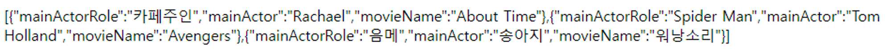
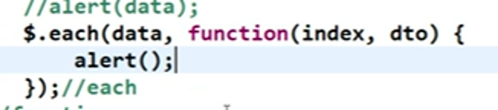
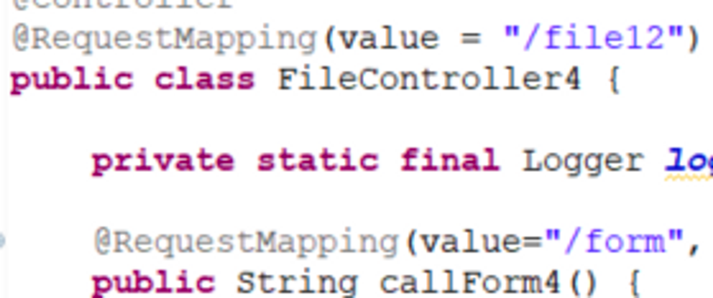
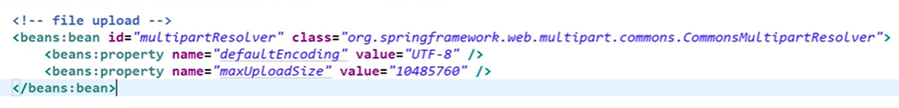

#  JSON / file upload

### JSON(Javascript Object Notation)

1. 자바스크립트의 객체를 표현(Notation)하는 법
    - 자바의 String으로 Object를 표현하는 법
    - 객체를 String으로 표현
2. 함수는 포함하지 않고, data만을 갖는 객체
    - 변수명 = data를 String으로 표현함.
    - 데이터를 저장하고 전송하는 데 사용되고 있음.
    - 텍스트 포맷의 특징을 가졌으며, 이해하기 쉽다는 장점을 가지고 있음.

    ```java
    '{"name":"John", "age":30, "car":null}'
    ```

    - 중괄호는 자바스크립트의 객체로써,

      그 객체 안에 name : value 형태로 값을 표현함.


```java
    const person = {
      firstName: "John",
      lastName: "Doe",
      age: 50,
      eyeColor: "blue"
    };
```
    
- 자바스크립트 생성자, 함수… → 함수 역시 가질 수 있음. 배열 형식으로도 표현이 가능함.
- 메소드 역시 자바스크립트의 객체 형태로 소유 가능함.
    - **JSON의 등장 배경**
        - 소켓 통신으로 Object(객체)를 주고 받는 것이 어려움
            
            → 이것의 대안으로 등장한 것이 JSON.
            
            따라서 JSON으로는 굳이 객체로 만들 필요 없이 String으로 보내주면 됨! (= 객체를 String으로 표현)
            
            (+) 자바 스크립트에도 객체가 있음 → 자바 스크립트의 객체로 표현  
          
 ---
    
- **정보시스템**   
        - 정보시스템은 key와 value의 쌍으로 이루어져 있음.    
        - name이 key로 이뤄져 있다는 것을 기억해두기       
            - 어떤 것을 찾으려고 한다면, name을 가장 먼저 찾아둬야 함.     
            - 예시            
                - Domian name System(DNS)와 IP Address - name / value    
                - 변수명과 변수    
                - html → `<input type = text>`    
                - router → 라우팅 테이블 : 자신과 연결된 다른 라우터의 주소 테이블, 모두 name과 value로 이뤄져 있음.    
                - 파일 시스템 → 파일명 = 물리적 주소를 대변함.     
                - 자바 객체 : 변수명 = data / method name = 물리 주소     
                    - 실행 영역의 물리 주소      
                    - name, value 값으로 이뤄짐      
                        - JSON에서 메소드는 다루지 않고 데이터만 다룸.        
                    
  ```java
                   JSONObject obj1 = new JSONObject();
                   obj1.put("원빈", "아저씨");
                   obj1.put("배역", "쌈짱");
   ```
    - name과 value가 들어간 것임. 결코 name 2개를 동시에 넣은 것이 아님!
  - JS 객체를 만들어서 배열에 넣고 화면 단에 전송해줌.

---

- 백엔드에서 JSON Object를 만들기 위해서는 라이브러리 2개를 추가해줘야 함.

    ```java
    		<dependency>
    			<groupId>com.googlecode.json-simple</groupId>
    			<artifactId>json-simple</artifactId>
    			<version>1.1.1</version>
    		</dependency>
    		<dependency>
    			<groupId>com.google.code.gson</groupId>
    			<artifactId>gson</artifactId>
    			<version>2.9.0</version>
    ```

    - JSON-simple
        - 객체를 만들고, 배열에 넣는 과정이 눈에 보이게끔 만들어져 있음. → 공부할 때 좋음
        - 과정이 보이지만 자동화가 되지 않는다는 단점이 있음.
        - for문을 사용하여 객체를 하나씩 넣어줘야 함.
    - gson
        - JSON-simple과 다르게 자동화가 되어서 스스로 하나씩 만들어짐.
        - 실제 현업에서는 gson과 jackson-databind를 사용함. json-simple을 사용하진 않음

  (+)

    - common-fileupload
        - apachi-group에서 만들어졌으며, tomcat / apachi-group의 것을 사용하면 됨
        - 파일 업로드를 위한 라이브러리

  (+)

    - 로그를 사용할 때 데이터가 in, out되는 것을 보기 위해서는 log4jdbc (log4j와 jdbc를 연결한 것)을 사용하면 됨

      → resultSet 및 데이터 쿼리 결과를 보여주는 로그

      → 스프링에서 db로 넘어가는 쿼리와 db에서 스프링으로 넘어오는 데이터를 모두 capturing하여 사용 가능.


---
    
### JSON 객체를 이용해 View단에 전달받은 데이터를 찍어보기
    
```java
    @RequestMapping(value= "/json11", method = RequestMethod.GET)
    	public String page4Json11(Model model) { //모델 받아주기 
    		
    		//화면 단에 보여주기 위해서는 String으로 리턴타입을 해야 함.
    		//json을 받을 객체 생성
    		//백 단에서 json이 만들어지는 부분
    		
    		JSONObject obj = new JSONObject(); 
    		obj.put("movieName","About Time");
    		obj.put("mainActor","Rachael");
    		obj.put("mainActorRole","카페주인");
    		
    		JSONObject obj2 = new JSONObject(); 
    		obj2.put("movieName","Avengers");
    		obj2.put("mainActor","Tom Holland");
    		obj2.put("mainActorRole","Spider Man");
    		
    		JSONObject obj3 = new JSONObject(); 
    		obj3.put("movieName","워낭소리");
    		obj3.put("mainActor","송아지");
    		obj3.put("mainActorRole","음메");
    		
    		// 이 객체를 한 번에 보내려면 JSONArray에 담아야 함.
    		
    		JSONArray arr = new JSONArray();
    		
    		arr.add(obj);
    		arr.add(obj2);
    		arr.add(obj3);
    		
    		//보내기 전에 로그 한 번 찍기
    		 logger.info(arr.toJSONString());
    		 
    		 //가져온 모델에 데이터를 담아 보내기 - key, value로 세팅
    		 model.addAttribute("jsonArrString", arr.toJSONString());
    		
    		 // 이 내용을 받는 json11이라는 jsp는 jsp폴더에 만들어야 함.
    		return "json/json11";
   ```
    
- 출력 결과
        
  
        
  → 대괄호(자바스크립트 배열)안에 자바스크립트 객체들이 있는 것을 확인할 수 있음.
        
  → for문을 사용하기 위해서는 문자열로 진행하면 안 됨. 모두 다 object로 나오기 때문에 반드시 문자열을 잘라서 사용해줘야 함.
        
  이 때 Miscellaneous의 each 쓰면 배열 안에 있는 객체들을 다 잘라서 사용 가능함.
        
  
        
  ```java
        function(data,status){
            //alert(data);
            $.each(data, function(index, dto){
                alert(index);
                //alert(dto);
                alert(dto.movieName);
                }
            );
        }//fuction
    ```
        
  → each를 사용하여 배열을 끊어서 내부에 있는 데이터들을 보여주고 있음.
        
  ```java
        $.get(
            "${pageContext.request.contextPath}/json12return"// , {} 보내는 데이터가 없을 땐 이걸 쓰지 않아도 됨
        		, function(data,status){
                    //alert(data);
        			$("#movie_tbody").empty();
        			$.each(data, function(index, dto){
                            //alert(index);
        					//alert(dto);
        					//alert(dto.movieName);
        			$("#movie_tbody").append(
        			"<tr>"
        			+ "<td>" + dto.movieName + "</td>"
        			+ "<td>" + dto.mainActor + "</td>"
        			+ "<td>" + dto.mainActorRole + "</td>"
        			+"</tr>"
        			); //append
        		});//each
        	}//fuction
        ,"json");//get
      
  ```
        
    
 → 옛날 방식으로,  for문을 사용해서 Object 하나마다 값을 세팅하여 넣어주는 방식이다.
    
요즘은 통째로 아예 값을 바꿔(Object → json)서 넣어준다.
    
예) **`gson.toString()`**으로 한 번에 변경 가능하다.
    
```java
   out.print(new Gson().toJson(list));
   ```
    
→ for문으로 하나하나 넣어주는 것보다는 한 줄로 위와 같이 간편하게 작성 가능하다.
   
 
---       
 
    
### Request Mapping 추가
    
- value를 한 번에 작성할 수도 있지만, 아래처럼 끊어서(Controller에도, Method에도)도 사용 가능하다
    

    
→ 이렇게 될 경우 Controller 밑에 있는 메소드까지 전부 가져와야 된다는 것을 잊으면 안 된다!
    
---
    
### File Upload
    
- 파일 업로드 시 선결 조건      
        1. pom.xml 안에 commons-fileupload 라이브러리를 등록하였는가?        
        2. 그 후 servlet-context에 파일 업로드에 대한 규칙(multipart-resolver)을 적용하였는가?        
            - defalutEncoding과 maxUploadSize에 대한 내용을 명시해야 함.



                
- 여기서 적용된 파일을 업로드하면, 파일이 쪼개져서 업로드 됨.        
- 사실, http는 신속하지도 않고 정확하지도 않음. 따라서 큰 용량의 파일을 서버로 보내게 되면 서버 응답 없음이 발생하는 것을 볼 수 있음.
                    
  용량을 많이 올리면 서버가 잘 안 돌아가게 됨
                    
  상업용 솔루션을 보면 http가 아닌, ftp를 사용한 파일 전송 솔루션을 쓰는 것도 마찬가지 이유에서임.
                    
  → 작은 그림판용일경우 http를 사용함.
    
3. form에서 데이터를 전송할 때 enctype을 확인해줘야 함. 
            
   enctype이 multipart/form-data(multipart이거나 form-data인지 확인)
            
   해당 부분을 쓰지 않으면 plain-text 데이터로 데이터가 들어오게 
            
    
---
    
- 파일 업로드 시, get 방식이 아닌 post 방식을 사용해야 함.
        
  get 방식의 경우 공식적으로 256바이트의 데이터만 지원해준다고 했기에 위험한 부분이 있음.
