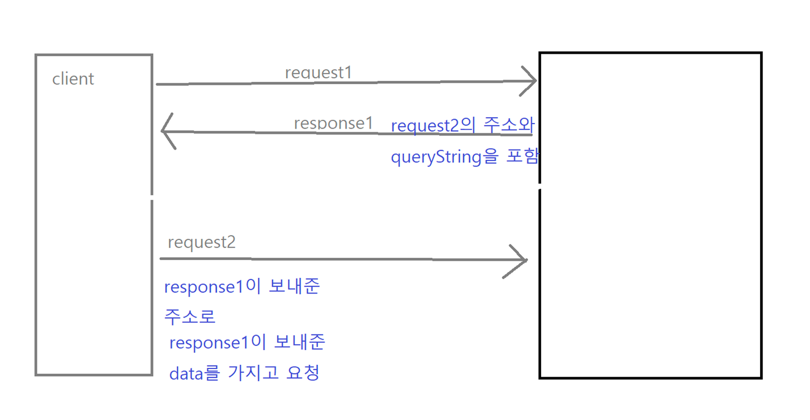
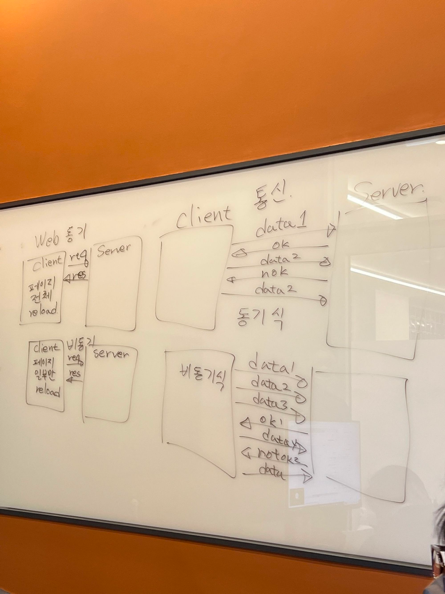

# JSTL / EL / AJAX

### JSTL과 EL

`EL`

**Expression Language**

- $와 중괄호를 사용하여 출력하는 표현
- key와 value 형태로 이뤄져 있음
- jsp 출력 태그 (`<%=출력 내용%>`) 과는 다른 모습
    - “”내에 있는 숫자도 모두 계산이 됨

        ```java
        <h1>+ : ${ "10" + 1 } : ${ null + 1 } : ${ "10" + "10" }</h1>
        ```

    - 위 코드의 결과는 11, 1, 20
    - 문자열 + 숫자 = 숫자
    - null + 1 = null
    - 문자열 + 문자열 = 숫자       
           
- eq / ne / gt / lt / ge / le
    - eq : ==
    - ne : !=
    - lt : <
    - gt : >
    - le : <=
    - ge : >=

---

- **Session, Request, model 객체 받기**

    ```java
    @Controller
    public class EL1Controller {
    	@RequestMapping( value = "/el2", method = RequestMethod.GET )
    	public String day1El2( Model model, FreeBoardDTO dto
    			, HttpServletRequest request, HttpSession session ) {
    
    		request.setAttribute("messageFromRequest", "이것은 리퀘스트를 통해 전달된 메세지 입니다."); //1
     
    		session.setAttribute("messageFromSession", "이것은 세션 통해 전달된 메세지 입니다."); //2
    
    		dto.setBno("111");dto.setBtitle("노인과 바다");dto.setBwriter("헤밍웨이"); //3
    		dto.setBcnts("sad ending");dto.setBdate("1945-08-15");
    		model.addAttribute("free_board_dto", dto); //4
    
    		return "day1el2";//jsp 파일 이름.
    	}//day1El2
    }
    ```

  **순서**

    1. request에 property를 담는다.
    2. session에 property를 담는다.
    3. dto를 받아와서 `setProperty`로 담은 다음,
    4. `model.addAttribute(”사용할 이름”, dto객체명)`을 입력하여 View 단에 전송한다.
    - **표기법**
        - IN JAVA
            - 첫단어 시작을 소문자로, 나머지는 대문자로. 클래스는 모두 대문자로 쓰는 카멜 표기법을 사용한다.
            - DB에서는 underbar(_)로, DB는 대소문자 구분이 없기 때문
            - html은 표기방법에 제한이 없음
            - model이나 request에 setAttribute할 때에는 제약이 없다. (underbar를 사용하든, 카멜 표기법을 사용하든 상관이 없다.)

              ⇒ 데이터를 뽑아내는 부분과 일치하기만 하면 된다.


---

- EL을 사용함으로써, 객체를 받는 부분이 자동화되었다.
    - `setAttribute`에서 설정한 이름으로 attribute를 받아올 수 있음.
    - `model에 담아온 이름(=setAttribute의 이름).getProperty(이름)`으로 출력하거나, `model에 담아온 이름(=setAttribute의 이름).그냥 속성의 이름`으로 출력할 수 있다.
        - model을 request와 같다고 생각하면 편하다.
            - model이라는 객체를 새롭게 만들 것일뿐, model은 생존 범위가 request와 같기 때문이다.
    - 객체가 비었는지, 아닌지를 구분하는 용도로 `empty`를 사용한다.

      오류를 줄이기 위해서 먼저 empty로 객체를 잘 받아왔는지 확인한 다음 받아오도록 하자.

        ```java
        empty "" : ${ empty "" }
        ```

    - 객체 접근
        - `${<표현1>.<표현2>}` 또는 `${<표현1>[<표현2>] }` 형식을 사용한다.

        ```html
        		<h1>글번호 : ${ free_board_dto.getBno() }</h1> //model에 담아온 이름(=setAttribute의 이름).getProperty(이름)
        		<h1>글제목 : ${ free_board_dto.btitle }</h1> //model에 담아온 이름(=setAttribute의 이름).그냥 속성의 이름
        		<h1>작성자 : ${ free_board_dto.bwriter }</h1>
        		<h1>작성일 : ${ free_board_dto.bdate }</h1>
        		<h1>내용 : ${ free_board_dto.bcnts }</h1>
        ```

- Controller 단

    ```java
    @RequestMapping( value = "/el3", method = RequestMethod.GET )
    	public String day1El3( Model model
    			, ArrayList<String> list, HashMap<String, String> map ) {
    
    		map.put("반장", "홍길동");map.put("부반장", "고길동");map.put("부장", "둘리");
    		model.addAttribute("mymap", map);
    
    		list.add("hi");list.add("hello");list.add("how are you");
    		model.addAttribute("mylist", list);
    
    		return "day1el3";//jsp 파일 이름.
    	}//day1El3
    ```

    1. parameter로 list, map을 받고
    2. 각각에 데이터를 담은 후
    3. `model.addAttribute(”view단에서 사용할 이름, 실제 객체”)` 로 세팅해주면 완료!

    ---

    - map을 받을 때

        ```html
        <h1>${mymap.get("반장")}</h1>
        <h1>${mylist.get(0)}</h1>
        ```

        - 설정이름.get(key)
        - 설정이름.get(index) → list는 순서를 보장하기 때문에 index를 사용해도 된다.

---

`JSTL`

**Java Standard Tag Library**

- JSP를 쉽게 사용하기 위해 만들어진 라이브러리
    - EL과 함께 사용하여 시너지를 낼 수 있다.
    - eclipse에서 사용하려면 따로 다운받아야 하지만, STS에서는 자동으로 사용할 수 있다.

    ```java
    <%@ taglib uri="http://java.sun.com/jsp/jstl/core" prefix="c" %>
    ```

  상단에 위와 같은 태그를 선언해야 사용 가능하다.


---

**변수 세팅 / 값 출력 - c:set, c:remove**

- `<c:out value=”값”/> <c:out value=”${변수명}”/>`

  `c:out` 태그보다 **el이 더 우수하기에 사실상 출력은 el이 담당**한다.

- `<c:set var=”변수명” value=”변수에 대입된 값” />`

  변수 선언에 사용한다.

- `<c:remove var=”변수명” />`

  변수 삭제에 사용한다.


---

**if문 : choose, when, otherwise**

- `<c:if test="${ condition }">`

  else if나 else가 없으며 하나만 비교할 때 `c:if`를 사용한다.

  여러 개를 비교하기 위해서는 `c:choose`를 사용한다.

- `<c:choose></c:choose>` 로 태그를 연 다음(여러 개를 비교할 때 사용한다), condition을 `c:when` 태그(= else if 역할)에 담아준다.

  만약 else의 역할이 필요하다면 `c:otherwise` 태그를 사용한다.

    ```java
    <c:choose>
    			<c:when test="${ jumsu > 90 }">A GRADE</c:when>
    			<c:when test="${ jumsu > 80 }">B GRADE</c:when>
    			<c:when test="${ jumsu > 70 }">C GRADE</c:when>
    			<c:when test="${ jumsu > 60 }">D GRADE</c:when>
    			<c:otherwise>F GRADE</c:otherwise>
    </c:choose>
    ```

  mybatis에서는 c:를 빼고 사용하면 된다.


---

**forEach**

1. items의 값 하나를 str에 담는다.
    1. varStatus = 반복문의 반복 횟수를 기억하는 변수
        1. index 0에서 시작
        2. count 1에서 시작
2. `<c:forEeach> </c:forEach>`
    1. var = 반복할 때 사용할 변수명
    2. begin 시작값 / end 종료값  / step 건너뛸 값 크기
    3. 이중 forEach 가능
3. forEach에서 전체 결과를 합산하기 위해서는 `c:set`을 사용하면 된다.

---

**forTokens**

```java
<c:forTokens var="fruit" **items**="${fruits}" **delims**="," varStatus="status">
			<h3>${fruit} : ${status.index} : ${status.count}</h3>
</c:forTokens>
```

delims를 기준으로 자르며, 자른 결과를 items에 담는다.

이 때 item 하나하나는 var이다.

---

**url**

```java
<c:url var="urlName" value="/jstl6">
			<c:param name="bno" value="112" />
			<c:param name="btitle" value="demian" />
			<c:param name="bwriter" value="heming" />
			<c:param name="bcnts" value="sad" />
			<c:param name="bdate" value="08-15" />
</c:url>
```

- url을 지정해주면 파라미터를 넘기는 예제
- `c:param` - 파라미터에 변수를 저장함.

  = Spring에서의 `pageContext.request.contextPath` 와 동일하다.

    - jsp의 `request.getContextPath()`와 같음.

---

**c:import**

```java
<c:import url="./day2jstl6.jsp">
			<c:param name="bno" value="115" />
			<c:param name="btitle" value="holiday" />
			<c:param name="bwriter" value="ro" />
			<c:param name="bcnts" value="i want holiday" />
			<c:param name="bdate" value="08-15" />
</c:import>
```

- `c:import는 jsp include와 동일하다.`
    - 다른 페이지를 컴파일 한 다음 결과만 가져오므로 변수가 공유되지 않는 다는 차이점이 있다.
- `include file="./header.jsp"`
    - 다른 페이지를 복사해 온 후, 컴파일을 함께 한다.(변수 공유 됨)
- **url VS import url**
    - **url**의 경우, Controller로 넘어간다. (requestMapping 호출)
    - **import url**은 **.jsp** 확장자가 붙음 = 바로 JSP 호출한다 (Controller를 거치지 않는다)

---

- **c:import 관계의 파일들은 서로 별개의 파일 → 변수 공유 안됨**
- **include file 관계의 파일들은 하나의 파일 → 변수 공유가 됨**

---

**redirect = response.sendRedirect**

- `c:redirect` = `response.sendRedirect()` - 새로운 다른 페이지를 실행시키는 역할
- 스프링 프레임워크에서 c:redirect의 url은 @RequestMapping의 value를 호출한다.

  


클라이언트가 request1을 보내면, 서버 측에서 request2의 주소와 queryString을 포함하여 응답한다.

이를 클라이언트가 다시 받으면 응답 시 보내 준 주소로 응답 시 서버 측에서 보내 준 데이터를 가지고 다시 요청한다.

---

**jstl:fmt**

- 상단에 아래와 같은 태그를 미리 선언해야 사용할 수 있다.

    ```java
    <%@ taglib uri="http://java.sun.com/jsp/jstl/fmt" prefix="fmt" %>
    ```

- 숫자나 날짜 형식을 바꿀 수 있다.

    ```java
    <h3>
    			YY/MM/dd HH:mm:ss :
    			<fmt:formatDate value="${now}" pattern="YY/MM/dd HH:mm:ss"/>
    		</h3>
    		<h3>
    			HH:mm:ss YY/MM/dd :
    			<fmt:formatDate value="${now}" pattern="HH:mm:ss YY/MM/dd"/>
    </h3>
    ```

- 같은 now여도, dataStyle에 따라 출력 결과가 달라진다.
- pattern을 지정해서 날짜 형식을 바꿔줄 수 있다.

---

**문자열 형식**

- 상단에 아래와 같은 태그를 미리 선언해야 사용할 수 있다.

    ```java
    <%@ taglib uri="http://java.sun.com/jsp/jstl/functions" prefix="fn" %>
    ```    

       

```java
		<h3>fn:replace(str, "You", "U~~") : ${ fn:replace(str, "You", "U~~") }</h3>
		<h3>fn:substring(str, 3, 11) : ${ fn:substring(str, 3, 11) }</h3>
		<hr>
		<h3>fn:indexOf(str, "To") : ${ fn:indexOf(str, "To") }</h3>
		<h3>fn:startsWith(str, "Ni") : ${ fn:startsWith(str, "Ni") }</h3>
		<h3>fn:endsWith(str, "o.") : ${ fn:endsWith(str, "o.") }</h3>
		<hr>
		<h3>fn:length(str) : ${ fn:length(str) }</h3>
		<h3>fn:contains(str, "meet")  : ${ fn:contains(str, "meet") }</h3>
		<h3>fn:containsIgnoreCase(str, "meet")  : ${ fn:containsIgnoreCase(str, "meet") }</h3>
		<h3>fn:toLowerCase(str) : ${ fn:toLowerCase(str) }</h3>
		<h3>fn:toUpperCase(str) : ${ fn:toUpperCase(str) }</h3>
```

- `split`은 결과가 array로 나온다. 즉, array 형태로 분리된다.
- `substring`은 뒤의 번지 수는 포함하지 않는다. 즉 ${ fn:substring(str, 3, 11)이라고 작성하면 10번 글자까지만 나온다.
- `contains`는 대소문자를 가리고 `containsIgnoreCase`는 대소문자를 가리지 않는다

---

### AJAX (Asynchronous JavaScript and XML)

- 전체 페이지를 새로 고치지 않고도 페이지의 일부를 위한 데이터를 로드하는 방식
- JavaScript를 사용한 비동기 통신, 클라이언트와 서버 간에 XML 데이터를 주고받는 기술
- `$.ajax`
    - get/post 선택해서 사용, 추가적으로 데이터를 더 붙이는 등 설정을 자세하게 잡을 때 사용
- `$.get`
    - get방식으로 서버와 데이터를 주고 받는다.
    - `**function(data, status) {**`
        - data : 서버가 보내는 결과값, status : 통신 성공여부

          연결이 되었는지 안되었는지만 따지기 때문에 internal error가 나도 status는 success로 판정된다.

    ```javascript
    $.get(
      "${pageContext.request.contextPath}/ajax11return" - 1
      , {
      data1 : $("#txt1").val() - 2
      , data2 : $("#txt2").val()
      }
      , function(data, status) { - 3
      $("#txtDiv").text(data);
      }
      );
  ```
  
 - 1.서버주소, 2.서버로 보낼 데이터, 3.call back method(서버가 돌려주는 결과값)     
            1. 서버주소    
                - `${pageContext.request.contextPath}` = 프로젝트 url
            2. 서버로 보낼 데이터    
                - 데이터명 : 보낼데이터     
            3. Call back Method(서버가 돌려주는 결과값)     
                - data = 서버가 보내는 결과값
                - status = 통신 성공 여부

                  → internal error가 나더라도 status는 success다 (연결이 되었는지 여부를 확인)

- JSON Mode ON
    - ajax data를 받아올 때 String으로 받는다.

```java
<script type="text/javascript">
	$(document).ready(function(){
		$("#btn1").click(function() {
			$.get(
					.
					.
					.
					}
			);
			//4.json mode on
		});//click
	});//ready
	</script>
```

- ajax data(Ajax Controller2.java)

    ```java
    @RequestMapping(value="/ajax11return", method=RequestMethod.GET)
    	public void ajax11Return(String data1, String data2, PrintWriter out) {
    		//!! 화면에서 보내는 변수명과 parameter의 변수명은 같아야 한다
    		out.print("신나는 " + data1 + ", 즐거운" + data2 + " !!");
    		
    	}//ajax11Return
    	//화면을 호출한다 = 동기 / 호출하지 않음 = 비동기, return type void여도 됨
    	
    	@RequestMapping(value="/ajax11", method=RequestMethod.GET)
    	public String page4Ajax11() {
    		return "./ajax11";//jsp file name
    	}//page4Ajax11
    ```

- 최근에는 XML보다 JSON을 더 사용함
    - 비동기식이란 여러가지 일이 동시적으로 발생한다는 뜻으로, 서버와 통신하는 동안 다른 작업을 할 수 있다는 것과 같음
        - 통신에서의 Syncronize VS Asyncronize (동기 VS 비동기)
            - Client VS Server

                
              
              **동기 통신**

                - 서버의 응답을 기다리기 때문에 delay가 있음.
                1. client가 server로 data1(packet)을 넘기면,
                2. server가 1에 Okay하는 response를 보낸다.
                3. 그 후 client가 data2를 넘길 때
                4. 만약 server가 okay를 하지 않으면

                   → 서버는 data2를 재전송해야 한다.

                   → 즉, 여기서 delay가 발생하는 셈이다.


**비동기 통신**
                
- 서버의 응답을 기다리지 않기에 delay가 없음.
  1. client가 server에게 data1, data2, data3을 보낸다.
  2. server가 ok하는 response를 보낸다.
  3. ok를 보내는 동안 다른 data4를 보낸다. 만약 보냈던 데이터 중 not okay가 오면 그 해당 데이터만 재전송해준다.
  
---
  
**WEB에서의 동기와 비동기**
    
- 페이지 전체가 동기화되어 있는지, 아닌지를 따지는 것과 같다
  
**동기**
        
- req, res가 한 번 일어나면 페이지 전체를 reloading하는 것을 의미
  
**비동기**
        
- req, res가 일어나더라도 페이지 전체가 아니고 페이지 일부만 reload하는 것

---
    
**contextPath = Project URL**
    
- url : `${pageContext.request.contextPath}`
  
→ server.xml의 Context Path


---