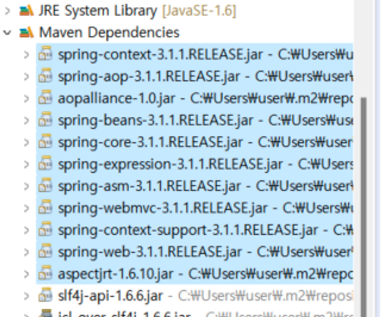
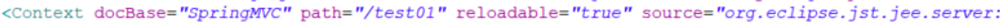
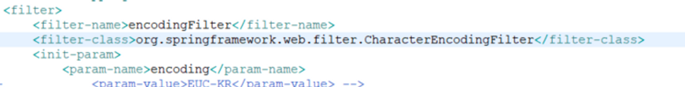
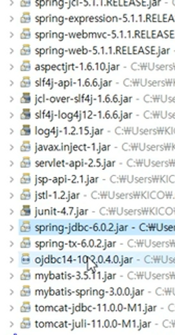
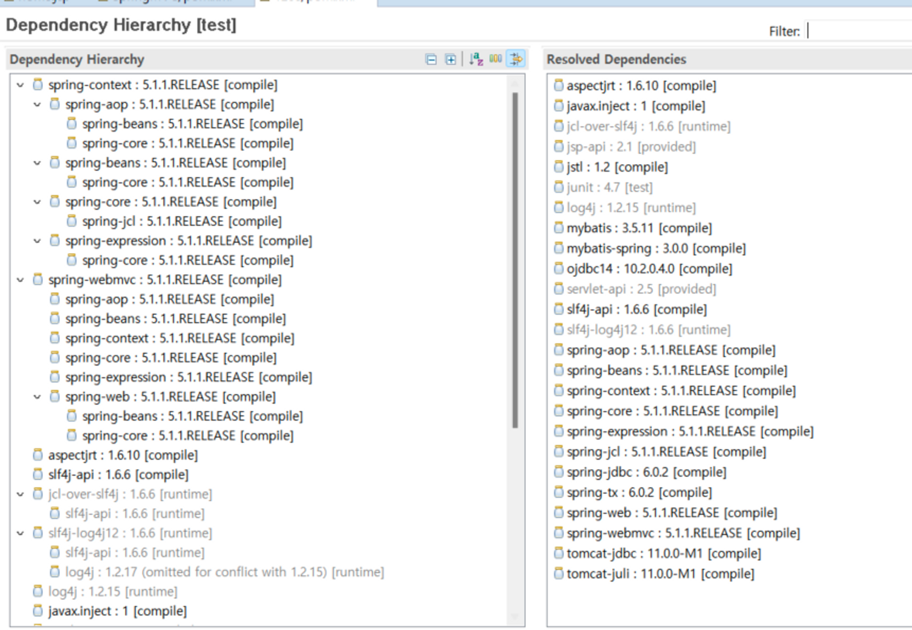
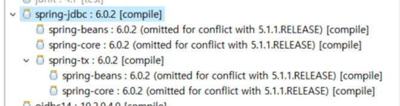
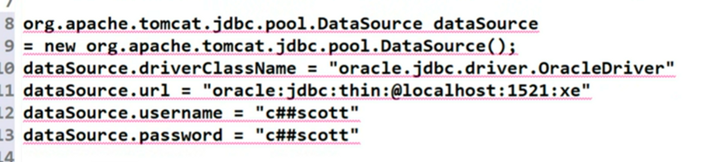
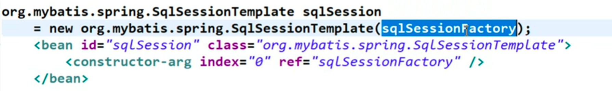
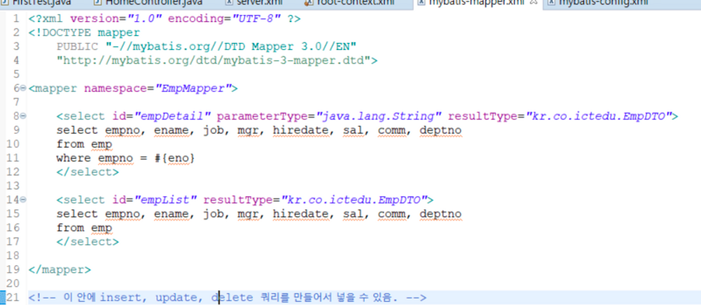
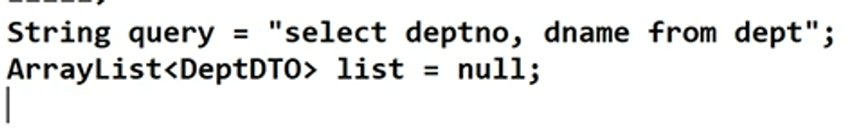

# STS / Spring & Maven / Mybatis 연동

### STS(Spring Tool Suite)

스프링 환경을 세팅해 놓아, 스프링을 사용하기에 적합한 것이라는 의미

→ Eclipse + tomcat + spring library

- STS Version4 : Spring mvc 미지원
- STS Version3 : Spring mvc 지원
- STS 3.9.12
    - jdk 8 지원, 그 이상은 jdk 11 지원.
    - 다운로드 시 jdk 버전을 다 따져야 하며, zip 다운 받아서 압축만 풀면 바로 사용 가능함.
- pivotal-tc-server는 tomcat 서버
    - 해당 서버를 킨 상태에서 tomcat을 한 번 더 실행하면, 중복으로 실행하겠다는 것과 마찬가지
- STS - 3.9.12.RELEASE는 이클립스 환경
    - tool의 버전, 프레임워크 버전은 각각 다르게 관리해야 함.
- Sprimg Transaction이 4.1.2 이상에 동작하므로 적어도 4점대 버전 이상을 사용해야 함.

    

- 스프링을 기본적으로 돌릴 때 필요한 라이브러리(필수 라이브러리) 리스트

  
    - 파란색으로 드래그된 부분 : 필수 라이브러리
    - log4j, slf4j는 로그여서 필수 라이브러리는 아님
    - 스프링 context, AOP, AOP-aliance, spring-webmvc, spring-web, spring-asm, aspectjrt
    - el은 jspl에 있음.
    - junit은 test 라이브러리
    
- 디폴트 워크 스페이스는 문서 밑에 잡힘
- Spring Legacy Project로 생성 후 → Spring MVC Project를 눌러 생성하면 됨.
    - 회사 이름 거꾸로 작성하는 이유

      소프트웨어를 만드는 회사의 제조사의 이름을 그대로 사용하면

      추후, 겹칠 수 있음. 따라서 테스트나 출시 시에 겹치지 않게 하기 위해서임.


---

### Software Engineering - 스프링의 등장배경

`목표`

- 적은 돈으로 개발하자 → 효율적인 개발을 하기 위함.
    - 복잡하지 않게 빠르게 개발할 수 있는 방법론을 찾다보니 등장한 것이 Framework

---

### VS Struts

Struts?

- Spring 이전의 프레임워크로, EJB(Enterprise JavaBean) 환경에서 MVC 방법론을 적용한 프레임워크이다.
    - MVC 방법론 : 디자이너(디자인) / 퍼블리셔(html) / FE / BE의 소스를 분리하자는 것이 기본 개념
    - Spring 프레임워크가 Struts를 벤치마킹해서 MVC 방법론을 사용함. → Struts보다 쉬움
    - 스프링은 서블릿의 개념이 안 보이게끔 알아서 자동화처리를 해주나,

      Struts는 보임. 그 외에 지금은 안 쓰는 기술이 살아있음.

- 오래 전의 프레임워크이기에, 현장가서 Struts를 직접 맞닥뜨릴 수 있음.

  Spring을 잘하면 비슷한 Struts도 대응하긴 편할 것!


---

### Spring과 Maven

`spring framework`

- **POJO (Plain old Java Object)**
    - 개발자가 pure한 자바 오브젝트를 코드에 넣으면,

      프레임워크 단에서 알아서 통신하고 데이터 객체 만드는 걸 다 하겠다는 것을 의미.

        - EJB에서는 스스로 개발자 혼자서 직접 다 코딩해줘야 했음.
        - 스프링 프레임워크에서는 순서를 고정시키고, 각각의 단계에서 객체가 스스로 옮겨주는 일을 프레임워크가 스스로 알아서 해줌.

          → 자동화의 증가

          → 개발자들은 전체 공정을 살피기 힘든 단점은 있지만, 적은 돈으로 빠르게 개발할 수 있음.

          → 즉, 빠른 개발에는 해당 프레임워크를 쓰는 것이 좋음


---

**`Spring MVC의 실행순서`**

1. Controller에서 시작한다. (= JSP 또는 화면을 직접 호출하는 것이 불가능하다)
2. **Request→ Controller → Service → DAO → Mapper → DB → DAO → Service → Controller → View** 화면 순으로 실행됨.

---

`Maven`

- **MAVEN : 저장소 + 프로젝트 관리 툴**
    - 스프링 MVC에서 maven이 차지하는 비중이 적음.
    - pom.xml(라이브러리의 저장소) : maven / maven.org에서 자신이 원하는 라이브러리 받을 수 있음.
    - sonatype에서 검색 후 latest-version 클릭

      [Maven Central Repository Search](https://search.maven.org/)

    - 라이브러리 자동 다운로드를 해줄 뿐만 아니라 라이브러리 간의 의존성을 고려하여 의존성 관리 역시 해 줌.
        - 저장소(pom.xml)를 갖춰 놓고,

          프로젝트에서 사용되는 라이브러리를 다운받아서 저장소에 저장시켜주는 역할임.

    - Spring MVC에서는 maven이 pom.xml에 라이브러리 목록 관리 + 라이브러리 다운로드 시켜주는 역할을 함.
    - m2가 maven 저장소임

      → C:\Users\user\.m2\repository


---

### [Catalina.properties](http://Catalina.properties) → 서버 포트번호 변경 가능한 곳

- catalina.properties에 들어가 보면, 실행되는 포트 정보가 있음.

  포트 번호를 고치고 싶으면 여기서 고치면 됨.

  

- 아예 포트번호를 지우려면 8080이 아니라 80으로 입력해서 기본 포트로 가게끔 하면 됨.

---

### Server.xml → 경로 변경 가능한 곳

- server.xml을 보면 프로젝트 이름이 등록되어 있음.

  

- 이 서버의 path를 바꾸면 기본적으로 접속되는 경로를 바꿀 수 있음
- 서버에서 오른쪽 마우스를 눌러 add & remove로 가서 프로젝트를 remove 후 finish하면

  server.xml에 적혀져 있는 내용이 사라짐.

    - 서버 관련 이야기
        - clean은 메모리를 지우는 것, 서버가 꺼진 상태에서는 의미가 없음
        - docbase = 실행할 서버의 기반 문서
        - path로 들어가면 그 문서를 실행하는 것임.

          path로 들어가기 싫다면, 지우고 “/”만 쓰면 됨.

          그 후 서버를 띄우면 됨.


---

### 출력 결과 한글 깨짐 해결 방법



→ 모든 캐릭터(문자)에 인코딩 필터를 적용하여 글자 깨짐을 방지하겠다는 의미

```java
<filter>
		<filter-name>encodingFilter</filter-name>
		<filter-class>org.springframework.web.filter.CharacterEncodingFilter</filter-class>
		<init-param>
			<param-name>encoding</param-name>
<!-- 			<param-value>EUC-KR</param-value> -->
			<param-value>UTF-8</param-value>
		</init-param>
		<init-param>
			<param-name>forceEncoding</param-name> <!--인코딩 방식 강-->
			<param-value>true</param-value>
		</init-param>
	</filter>
	<filter-mapping>
		<filter-name>encodingFilter</filter-name>
		<url-pattern>/*</url-pattern>
	</filter-mapping>
```

- JSP 선언이 없을 경우 한글 깨짐 확률이 더 높아지므로 아래 코드를 제일 위에 배치해두는 것이 좋음.

```java
<%@ page language="java"
         contentType="text/html; charset=UTF-8"
         pageEncoding="UTF-8" %>
```

---

### TOMCAT JDBC 관련 이야기

- Spring-JDBC가 있어서 사실, 중복으로 잡을 필요가 없음

  connection full은 접속할 때마다 딜레이 타임이 생기니까 그걸 만들어서 들고 있다가

  connection이 필요할 때마다 던져주면 됨.

  → root context 잡으면서 진행


---

- DB 접근을 위해 필요한 중요한 파일들

 

  → spring-tx는 트랙잭션 처리를 해주는 것

  → juli 같은 건 내가 직접 다운 받진 않았지만 maven이 알아서 라이브러리 종속성으로 다운 받게 해 줌.

  

    


---

### Controller 사용법

기본으로 프로젝트를 사용할 때 나타나는 home.jsp는 서버에서 실행되어 클라이언트 단에 보여줌 → 클라이언트 쪽에 조금 더 가까움

```java
<form action="./EmpList"> <- Action 단에서 서블릿을 호출해야 됨
		<button> 사원 목록 조회 </button>
	</form>
```

---

1.

스프링에서는 서블릿을 만들 필요 없이, 그냥 바로 자바를 만들면 되며 스프링에서 자바를 기반으로 바로 정의만 해줘도 됨. (POJO)

따라서 정의할 때 정체성을 부여해줘야 함.

Controller일 경우 Controller라고 선언을 해야 됨 → Anotation을 통해 해주면 진행하면 됨.

```java
@Controller //Anotation
public class FirstTest {	
}// class
```

---

2.

request를 method에 매핑해줘야 함.

→ form에서 들어온 값(value)를 가져와서 하단의 메소드에 매핑해 줌

→ method 역시 JSP의 form method와 동일하게 맞춰줘야 함.

```java
@RequestMapping(value="/select_all_emp", method=RequestMethod.GET) //JSP의 form method와 동잏하게 맞춰줘야 함.
	public String selectAllEmp() {
```

---

```java
<beans:bean class="org.springframework.web.servlet.view.InternalResourceViewResolver">
		<beans:property name="prefix" value="/WEB-INF/views/" />
		<beans:property name="suffix" value=".jsp" />
	</beans:bean>
```

시스템 안쪽의 view 자원에 대해 통일을 시켜주는 역할을 수행함.

파일 이름만 알려주면, 자동으로 prefix(경로)는 앞에, suffix(확장자)는 뒤에 붙여지게 됨.

Controller에서 return하는 문자열은 저 View Resolver에 대해 파일 형태로 바뀌어지면서 수행됨.

---

### MyBatis와 JDBC 5단계

`JDBC 5단계`

1. 드라이버 로딩 : 접속 프로그램 실행
2. 커넥션 연결 : 아이디, 패스워드, 주소, 포트, db 이름
3. 쿼리 진술 : statement라는 객체 사용
4. 결과 내용 확인 : resultSet 객체 사용
5. 커넥션 종료

→ Mybatis는 이러한 JDBC 5단계 과정을 간단하게 수행함.

---

### DBCP와 JDBC

DBCP : DataBase Connection Pool

→ 데이터베이스 커넥션이 가득 담긴 상태를 의미

→ 미리 동시접속자를 대비해서 커낵션을 몇 개 이상(유지하는 커넥션 개수는 사이트 정책마다 다름) 유지하는 기술을 뜻함.

→ 커넥션 툴을 만들기 위해서는 연결, 반환, 종결이 모두 필요하며 이 과정을 모두 DBCP가 다 수행함.

---

### TOMCAT의 JDBC Pool

```java
<bean id="dataSource" class="org.apache.tomcat.jdbc.pool.DataSource">
```

- 드라이버(접속 프로그램) 로딩, 커넥션 연결, 커넥션 종결을 모두 수행함.
- 드라이버를 통해 접속할 때 ip 포트, DataBase의 이름, 유저 이름, 패스워드가 모두 필요함.

```java
<bean id="dataSource" class="org.apache.tomcat.jdbc.pool.DataSource">
		<property name="driverClassName" value="com.mysql.cj.jdbc.Driver" />
		<property name="url" value="jdbc:oracle://127.0.0.1:1521/XEPDB1?autoReconnect=true&amp;serverTimezone=UTC&amp;useUnicode=true&amp;characterEncoding=utf8" />
		<property name="username" value="c##scott" />
		<property name="password" value="tiger" />
		<property name="initialSize" value="10" />
		<property name="maxActive" value="100" />
		<property name="maxIdle" value="30" />
		<property name="minIdle" value="5" />
	</bean>
```

- 최초 사이즈 : initialSize
    - 처음 톰캣 부팅 시 커넥션 풀 10개를 세팅해놓음.
- 최대 액티브 (활동) : maxActive
    - 최대 동시접속 가능한 사용자 수, 전체 개수로 minIdle + 동시접속자 수를 합쳐 이 인원을 넘으면 안 됨.
- maxIdle
    - 최대 인원을 채웠다가 또 접속을 안 하게 되면, 유휴 커넥션이 생김.

      이 때 유휴 커넥션을 어느 정도 둘 지 정하는 기준

- minIdle
    - maxActive에 도달하기 전까지 계속 최소 5개씩은 유휴 커넥션을 만들어 놓아 바로바로 쓸 수 있게 만들라는 의미

위의 xml 코드를 java로 변형시키면 아래와 동일함



---

### myBatis 연결

```java

	<bean id="sqlSessionFactory" class="org.mybatis.spring.SqlSessionFactoryBean">
		<property name="dataSource" ref="dataSource" />
		<property name="configLocation" value="classpath:/META-INF/mybatis-context.xml"/>
	</bean>

	<bean id="sqlSession" class="org.mybatis.spring.SqlSessionTemplate">
		<constructor-arg index="0" ref="sqlSessionFactory" />
	</bean>

	<bean id="transactionManager" class="org.springframework.jdbc.datasource.DataSourceTransactionManager">
		<property name="dataSource" ref="dataSource"/>
	</bean>
```



- spring.SqlSessionFactoryBean의 변수명이 id → sqlSessionFactory임
- sqlSessionFactory에서 DataSource를 사용하겠다는 의미
    - 쿼리를 날리고 데이터를 쓰기 위해서는 데이터 connection이 필요하므로 jdbc 관련 정보를 가지고 오겠다는 것과 같음.
    - 이때 ClassPath가 접근하는 경로는 mybatis-context.xml으로 해당 파일은 경로를 담고 있는 파일임. (공식적으로는 context가 아니라 config를 사용함)

      (+) 추가

        - src/main/webapp/resources → css나 이미지가 들어감
        - src/main/resurces/META_INF에 그 경로 파일을 넣어둬야 함 → 보낼 자원이 여기에 있다는 것을 의미함.

---

- 쿼리의 경우

  

    - sqlSessionFactory 기반으로 쿼리를 만들겠다는 것과 동일함.

    ```java
    <?xml version="1.0" encoding="UTF-8"?>
    <!DOCTYPE configuration
    	PUBLIC "-//mybatis.org//DTD Config 3.0//EN"
    	"http://mybatis.org/dtd/mybatis-3-config.dtd">
    
    <configuration>
    	
    	<mappers>
    		<mapper resource="META-INF/mybatis-mapper.xml" />
    	</mappers>
    
    </configuration>
    ```

  (+)

  주석을 configuration 태그 안에 작성하면 에러가 날 확률이 높으므로,

  밖에다가 작성하도록 하자.


---

- Mapper의 경우 쿼리가 담겨있음.

  

  쿼리 실행(진술) / resultSet 내용 세팅을 사전에 해줘야 함.

  

  하지만, 이 코드만 쓰면 myBatis가 jdbc 5단계를 자동으로 알아서 해 줌

  → DB 작업을 정형화하여 쉽고 빠르게 만들어주는 역할을 수행함.


---