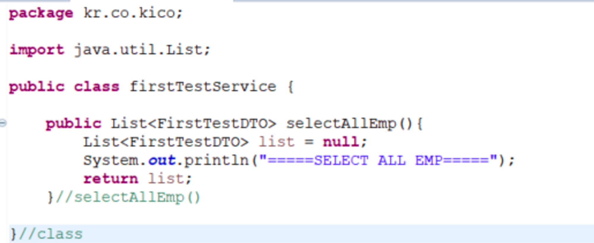
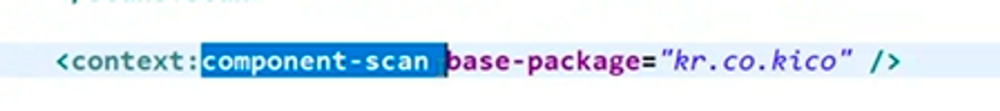
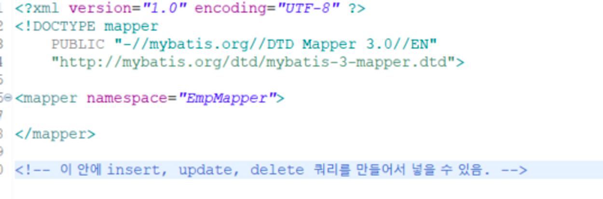

# Spring 특징

### Spring 특징

1. AOP(Aspect-Oriented Programming) : 관점지향 프로그래밍
    - 중간에 interupt하는 것으로, 끼어들게 만드는 객체는 개발자 측에서 준비해두면 된다.
    - 주로 로깅, 트랜잭션, 에러 처리 등 비즈니스 단의 메서드에서 조금 더 세밀하게 조정하고 싶을 때 사용한다.
        - 메소드 전후의 지점에서 자유롭게 설정이 가능하다. 이때 주소, 파라미터, Anotation 등 다양한 방법으로 대상을 지정할 수 있다.
    - 독립적으로 분리하기 어려운 부가 기능을 모듈화하는 방식.

      예) 객체지향 프로그래밍은 어플리케이션을 설계할 때 책임과 관심사에 따라 클래스를 분리하는데, 이 때 관심사끼리 중복되는 기능이 있을 경우 각 클래스마다 이를 중복해서 작성해야 한다.

      따라서 시점별로 이를 작성하기 위해 등장한 것이 바로 AOP.

      [AOP 입문자를 위한 개념 이해하기](https://tecoble.techcourse.co.kr/post/2021-06-25-aop-transaction/)

2. IOC (Inversion of Control : 제어 역행, IOC 컨테이너 - 경량 컨테이너 / 자바 객체를 스스로 관리한다.)
    - 과거에는 개발자가 모두 제어했지만, 이제는 프레임워크가 다 제어하게 되었음
    - 어플리케이션의 느슨한 결합을 도모함
    - 제어권이 사용자가 가이나 프레임워크에 있기에 필요에 따라 Spring에서 사용자의 코드를 호출함.
3. DI (Dependency Injection)
    - 각각의 계층이나 서비스들 간에 의존성이 있을 경우, 개발자가 아니라 스프링이 알아서 객체 사이의 의존성을 넣어줌.

      개발자가 객체 내부에서 직접 넣어 줄 필요 없음.

        - 예) `@auto-wired`
    - 의존성 자동 주입 예시

      → 커피자판기(Spring)에서 자동으로 컵에 담긴 커피(커피는 컵에 의존함)가 나오는 것

      → 그 컵을 자판기에 끼어넣는 건(AOP) 사람이 직접 함. 즉, AOP는 사람이 스스로 한다고 보면 됨.

4. POJO(Plain Old Java Object)
    - 특정 기술에 종속되어 동작되는 것이 아닌 순수한 자바 객체 그 자체.
    - POJO만 써도 스프링이 알아서 연결해준다.

---

### Spring 특징

- Controller의 request mapping에서부터 spring mvc가 실행됨
    - 직접 jsp나 view단에서 화면을 실행할 수 없음
    - jsp에서 for문 돌려서 view 화면 단에 뿌려주면 됨.

---

- spring은 라이브러리가 굉장히 제한적인데, maven에서 pom.xml을 사용하여 라이브러리와 그 의존성을 관리함.

---

- MVC 모델 예시

  A 중국집 : 사장님 혼자 주문 받고, 재료 꺼내고, 요리해서 서빙

  B 중국집 : 사장님 주문받고, 보조는 재료 꺼내고, 주방장은 요리해서, 웨이터가 서빙

  → A 중국집은 빠르고 효율적인 서비스가 안 됨.

    - 사장님 = 컨트롤러
    - 보조 = DAO / Mapper, Mybatis
    - 주방장 = Service
    - 웨이터 / 배달 기 = Model
- **MVC 모델 실행 순서**
    - **컨트롤러 → 서비스 → dao → mapper → db → mapper → dao → 서비스 → 컨트롤러 → 모델**

---

- 과거 방식과 Spring을 사용한 방식

    ```java
    FirstTestSerive service = new FirstTestService();
    ```

  일일히 new해서 객체를 생성하지 말고, Spring한테 스스로 알아서 직접 가져오라고 해주자.

    ```java
    @Autowired firstTestService service;
    ```

  → Anotation `@Autowired` 를 통해 자동으로 객체를 생성할 수 있음. 현재 컨트롤러 객체에 다른 객체를 묶어주겠다는 의미를 가지며, 해당 어노테이션이 있는 경우 스프링에서 자동으로 객체를 만들어 준다.
    
  ---


(+)

- 자동화 메소드가 기본적으로 null 값을 리턴하는데, 추후에 이 null로 인해 오류가 생길 수 있음.

  따라서 객체를 만들고 null을 시켜놓는 것이 좋음!

    ```java
    List<FirstTestDTO> list = null;
    return list;
    ```


---

### Anotation 유무와 Anotation이 하는 역할



→ 위의 상태로는 작동하지 않음. Anotation이 없기 때문


→ 실제로 실행시켜보면 위와 같은 에러가 뜸. Bean이 없어서 스프링에 등록이 되어 있지 않음.

따라서, auto wired가 불가능함. 즉, 실행 불가능한 프로젝트가 됨.

---

auto wired에서 자동으로 객체를 찾아다가 new를 해야 되는데, 스프링이 스스로 new를 수행할 수 있는 객체와 그렇지 못한 것으로 나눠야 함.

**그것을 구분하는 것이 Anotation임**. → 그 Anotation이 붙은 것들은 모두 Auto wired가 가능한 대상임.

목록들은 모두 Spring이 서버 부팅할 때 자신들이 만들어서 가지고 있는 것!

Controller나 서비스, DAO 이런 Anotation들은 이 클래스를 스프링에 등록하는 역할을 수행함.

실제로 Component-scan을 통해 repository 같은 Anotation들을 스캔함.



위를 보면 알 수 있듯, 그러한 스캔을 수행하는 것이 kr.co.kico 패키지이므로 이 패키지에서 컴포넌트를 찾아오겠다는 것과 동일함.

에러가 발생할 경우 로딩이 되지 않은 걸 수 있으므로 재시작하거나, clean 후 시작하기!

---

### MVC 모델에서 서비스가 하는 역할

서비스가 MVC 모델에서 하는 것이 없다고 생각되어 논의가 많이 되고 있음.

그러나, 규모가 큰 시스템에서는 충분히 그 역할을 수행하고 있음. 규모가 작은 시스템에서는 Controller와 mapper만 일하기 때문에 그렇게 착각할 수 있음.

예를 들어, A 시스템에서 데이터를 가져오고 그걸 처리한 후 해당 내용을 B 시스템으로 보낸다고 해야할 때,

데이터가 담긴 DB는 1개지만 시스템은 3개 이상 연동되게 된다.

이 때 서비스가 이러한 내용들을 수행해줘야 하며, 각 구성요소가 어떤 역할을 수행하는지 살펴보면

- mapper → DB
- Controller → 클라이언트와 데이터를 주고 받는 것이 주 임무
- DAO → DB 관리가 주 임무, Spring에서는 repository가 수행.

---

### Mybatis와 Mapper

- Mapper에서는 DB 쿼리가 담겨 있음.
    - 수정 `update`, 삭제 `delete`, 조회 `select`, 삽입 `insert` 모두 사용 가능
    - 한 태그 당 statement(=SQL)은 1개만 실행되며, statement의 parameter에서는 SQL과 결합해야 될 값(검색어)를 보내준다.

      SQL을 바로 적지 않고, MapperName.MapperMethodName을 통해서 Mapper에 바로 접근이 가능하다.

    - MapperName과 MapperFileName은 서로 다른 존재!
        - MapperFileName 호출 금지! MapperName으로 호출하자.
        - MapperName은?
            - mybatis-mapper,.xml에서의 namespace 부분이 바로 MapperName임.

              

                ```java
                <select id="selectAllEmpList" resultMap="kr.co.kico.FirstTestDTO"> 
                ```

              → 전체 경로를 통해서 Mapping을 수행해야 함.

        - Mapper 안에 SQL 쿼리를 넣을 때 되도록이면 세미콜론을 넣어두는 것이 좋음
        - 해당 프로그램에서 사용하는 데이터가 어떤 것인지 명시해 둘 필요가 있음.

          → NOT * 사용!

        - **Mapper와 DTO가 연결되어 DAO로 전달하면 서비스가 이를 받아서 Controller로 전달**함.

          이때 DAO가 제대로 수행했는지, 수행하지 않았는지 확인해보기 위해 그 곳에 테스트 코드를 넣어둬야 함.

    

        
### DTO와 toString()
        
`toString()을 하기 전 값`
        

        
DTO의 주소값은 아니고, JVM에서 관리하는 객체번호로 이 번호를 변환하여 DTO를 사용한다고 보면됨.
        
`toStiring()을 한 후 값`
        

        
이 DTO의 내부 값을 jsp 쪽으로 넘겨주기만 하면 됨.
        
(Request를 담는) 모델 객체를 사용해서 내용을 담아주면 됨.
        
Model 역시 Spring이 만들어서 의존성을 주입시켜줌.