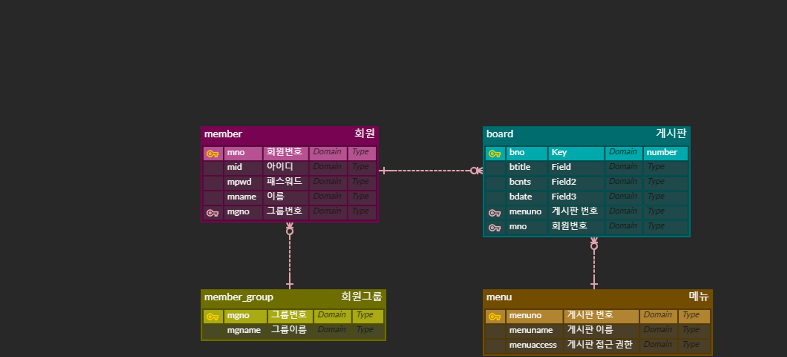
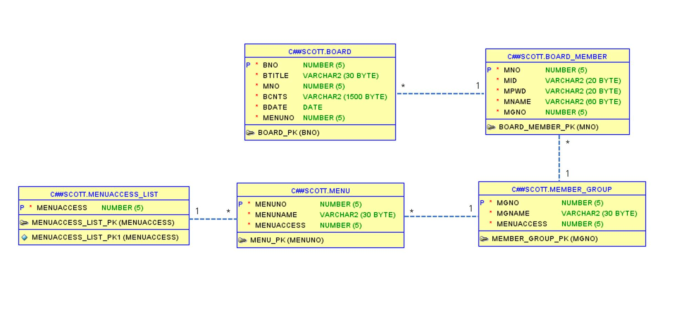

# CMS Project

`목표`    
교육 중 배운 **spring, mybatis, jsp**를 기반으로 User들과 그들이 생성한 콘텐츠를 관리하는 시스템 개발

`수행기간` 2022.12.21~12.27

`개발한 서비스 개요 및 특징`   

- 그룹 권한
    - 가장 높은 권한을 가진 그룹은 관리자 그룹이다.
    - 관리자 그룹은 0번의 권한을 가졌으며, 가장 낮은 권한을 가진 그룹은 10번이다.
    권한 숫자가 클수록 권한이 낮으며, 서비스 이용에 제약이 더 커진다.      
      (예: 2번 권한을 가진 그룹은 3번 권한을 가진 그룹보다 제약이 적다.)
    - 0번은 관리자 그룹, 1번은 일반 사용자 그룹으로 이 두 그룹은 default이며, 그룹 페이지에서 수정이 불가능하다.
    
    
- 일반적으로 관리자 포함 모든 회원들이 접근 가능한 기능(게시글 작성, 수정, 삭제, 조회)와 관리자만 접근 가능한 기능(게시판 관리 / 회원 그룹 관리 / 회원 관리)을 따로 설계하였다.

`과제 및 수행 업무 목록`

- 게시글 기능
    - 게시글 작성 / 조회 
        - 본인이 현재 가진 그룹 권한보다 높은 게시판에서 글 작성 / 조회는 불가하다.
    
    - 게시글 수정 / 삭제
        - 작성자 본인이나 관리자 그룹에 속한 회원이 아닌 이상 글 수정 / 삭제가 불가하다.
    

- 회원 가입 / 로그인
    - default로 회원가입된 사용자는 일반사용자 그룹(그룹 권한 1)으로 지정된다.
    - ID 중복체크 / 비밀번호 재확인 / 유효성 검사를 진행해야 회원가입이 가능하다.
    - 로그인 시 세션에 회원정보를 담아 전달하였으며, 로그아웃이 세션이 invalid 된다.
    

- 관리자 기능
    1. 게시판 관리
       - 게시판에 접근할 수 있는 회원 등급 수정 가능
        - 게시판 이름 수정 
        - 게시판 삭제 가능. 게시판 삭제 시, 게시판 내에 들어있는 게시글 역시 전부 사라진다.
    2. 회원 관리
       - 회원이 현재 속한 그룹 수정 가능
       - 회원 닉네임 변경
       - 회원 탈퇴 가능
    3. 회원 그룹 관리
        - 회원 그룹 이름 변경
        - 회원 그룹이 가진 그룹 권한 수정 가능
            - 단, 관리자 그룹과 일반사용자 그룹은 그룹권한 0과 1을 각각 가졌으며, 수정 및 삭제가 불가능하다.
        - 회원 그룹 수정  / 삭제
    
`ERD - 설계단계` 

`ERD - 최종단계`

`시연 영상 확인`    
[시연영상 보러 이동!](https://www.notion.so/work-planning-diary/279914cc308b4af5b6b5d5327bf73061#9dc89683928e468eb9ad9bb86a3d00aa)