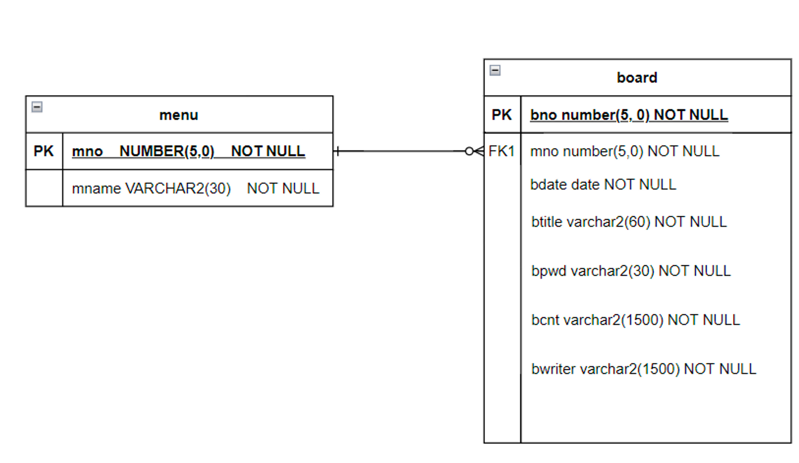

# Dynamic_board

`목표` 교육 중 배운 **spring, mybatis, jsp**에 익숙해지기 위함

`수행기간` 2022.12.19~12.20

`개발한 서비스 개요 및 특징`   

- 익명으로 자유롭게 게시글을 작성 / 수정 / 삭제할 수 있다.
- 게시판 역시 익명의 사용자가 이를 생성하고, 삭제가 가능하다. 
    - 게시판 수정도 익명의 사용자가 할 수 있다.
    
- 모든 서비스 사용자는 익명으로, 같은 접근 권한을 가진다.
- 메인 화면의 경우 전체 글을 확인할 수 있다.

`과제 및 수행 업무 목록`

- 과제 1. 게시판 생성 / 삭제 / 이름 수정 기능

    - 특정 게시판을 누를 경우 그 게시판에 속한 게시글만 조회할 수 있다.
    - 게시판을 생성할 수 있다.
    - 게시판을 삭제할 수 있다.
      - 게시판을 삭제할 경우 그 게시판 내에 있는 모든 게시글이 삭제된다.
    - 게시판의 이름을 수정할 수 있다.
    

- 과제 2. 게시글 생성 / 삭제 / 수정 기능

    - 게시글을 생성할 수 있다.
    - 작성한 게시글을 모두가 조회할 수 있다.  
    - 게시글은 작성한 본인만 삭제할 수 있다.
    - 게시글을 작성한 본인만 수정할 수 있다.
        
        - 작성자 본인이 아닌 경우 수정, 삭제 버튼이 보이지 않는다.
    
`ERD`

